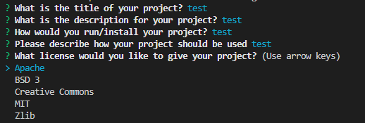

# Readme Generator

## Description

This product is designed to create a professional README file for any project/repository, from various user inputs.

## Table of Contents 

* [Installation](#installation-instructions)

* [Usage](#usage-information)

* [License](#license)

* [Contributing](#contributing-guidelines)

* [Tests](#test-instructions)

* [Questions](#questions)

## Installation Instructions

Please follow these steps when running this application.   1. git clone the repository to your local machine.  2. In terminal, CD into your destination folder demo.  3. Type and enter 'npm install' to install any dependencies.  4. Type and enter 'node index.js' to run the application.

## Usage Information

This project should be used to create README files for git repositories, sample README files for alteration and/or provide an open source code for users to see how to create an application similar to this one.  Hints to handling this application:   - Should you want to place something on a new line, please use a line break "<br/_>" (without the _ ). - If you would like to add new headings, please use ## before the heading name on a new line.

Link to video instructions on how to run the application:  
https://1drv.ms/v/s!Avf51vHVO9u7mC8xoucp7vdZX3PT  

example of questions layout:
  

## License

MIT: Permissive free license software. Please visit https://opensource.org/licenses/MIT for more information.
  
## Contributing Guidelines

Flipper5001 was the sole contributer for this project. If you wish to make any contributions, please refer to the questions section for our contact information.

## Test Instructions

The README file you currently read was created with this application as proof of its capability to produce a final product. The screenshots and video were added after the creation of this README.

## Questions

Other works can be found on https://github.com/Flipper5001.

If you have any questions or queries, please contact the following email address and we will get back to you as soon as possible.  
placeholder@gmail.com

